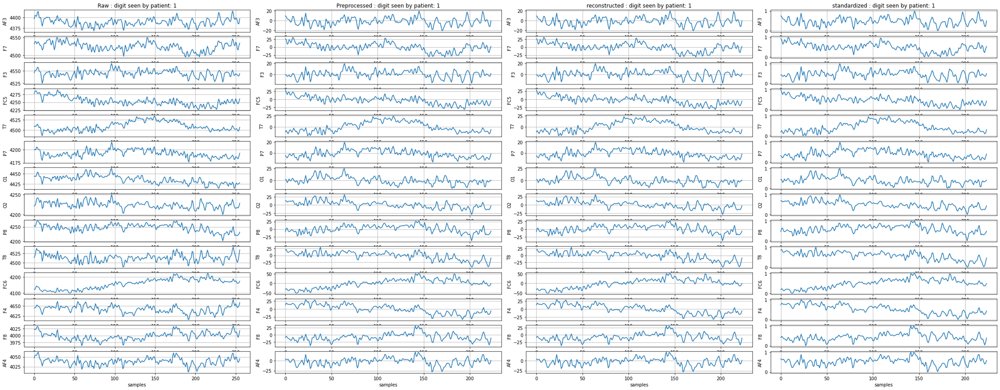

# EEG-based classification of imagined digits using low-density EEG
Digit classification using low-density EEG

Aim : to classify the imagined speech of numerical digits from EEG signals by exploiting the past and future temporal characteristics of the signal using several deep learning models  
EEG signal processing : EEG signals were filtered and preprocessed using the discrete wavelet transform to remove artifacts and retrieve feature information  
Feature classification : multiple version sof multilayer bidirectional recurrent neural networks were used

### EEG data
EEG signals from each trial were recorded for 2 seconds. 128 Hz sampling rate and 14 channels.
- EPOC 
- MUSE

### Results 

### Data preprocess
Raw -> preprocess(filters) -> reconstruction(wavelet transformation) -> standardization

